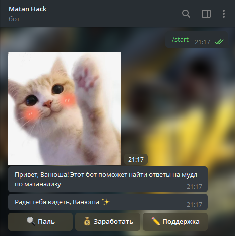
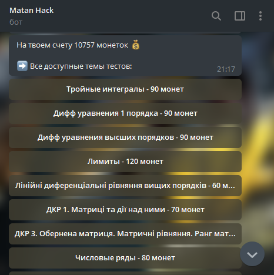
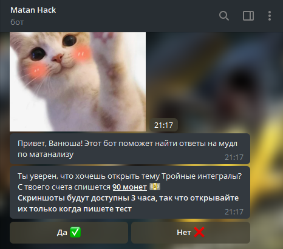
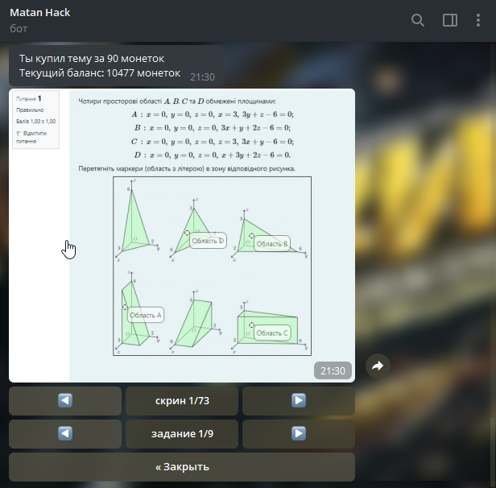
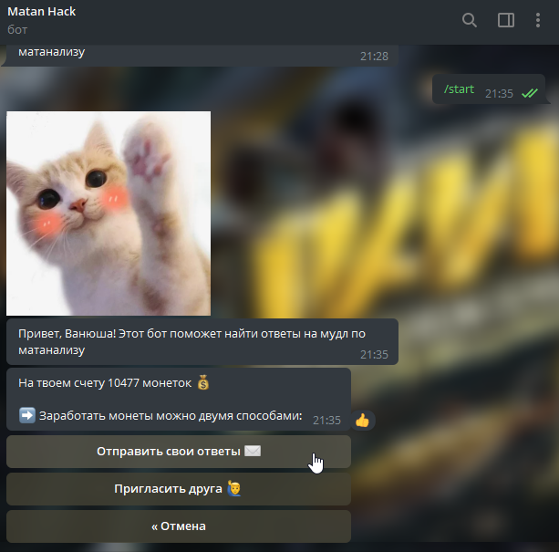
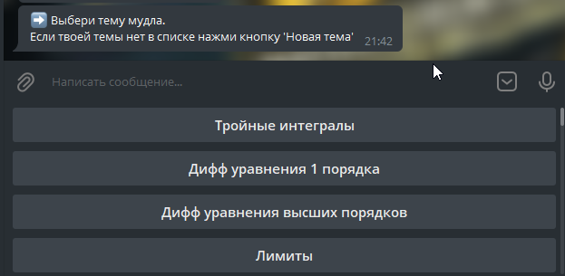
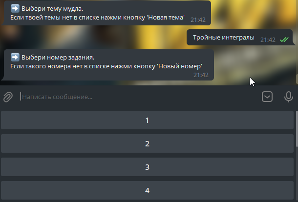
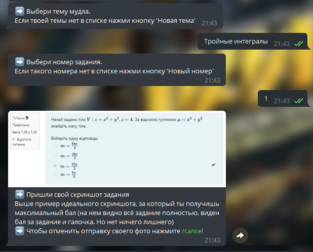
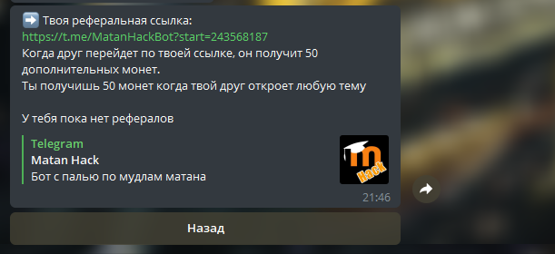
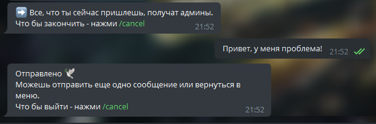

# MoodleHackPublic
 Public repository of matan hack telegram bot

You can find bot by this [link](https://t.me/MatanHackBot) or by tap a picture above

##Description

In our bot, you can get screenshots of tasks in mathematical analysis or linear algebra from moodle. 
But every test has a price. This is not real money, but only virtual coins that you spend on opening tasks. You can get coins either by sending your screenshots or by inviting friends.

We want to announce that now, instead of a dozen channels and chats, we will have only one bot - 
[@MatanHackBot](https://t.me/MatanHackBot) 😊

There you can find all our old screenshots that we have saved this remote year, as well as, of course, 
send your own 😁

Since many people just look at the answers, but do not share theirs, we have introduced a system of 
coins in the bot. This is done to stimulate you and develop our project.

It's simple - when you upload your screenshots - you get coins, and when you look at other people's - 
spend them!

We tried to make the bot as simple as possible, but if you suddenly have questions, you can ask them 
in our [chat](https://t.me/joinchat/SJxTqarixuOn_sOx) using the "write to admins" button in the bot 
menu, or using our [old offer bot](http://t.me/Predlozhka4Bot) - it will still work for a while :)

All successful studies and good mood, do not forget to invite your friends to get even more coins😘

Well, I would also like to say that at first the bot will work in test mode. Please report all bugs 
to us (via the menu button "write to admins" or the [old bot-offer](http://t.me/Predlozhka4Bot))

##Usage
###Showing other people`s screenschots
1) Click start button or /start command. You will see user menu:

2) Click "Паль" button to show available themes (40+ themes for now):

3) Choose theme and confirm:

4) You will see a screenshot of the first task and navigation buttons:

You can leaf screenshots and change tasks. 
When you finish your test, press close button, or test will close in 3 hours after start.

###Sending your screenshots

1) In main menu click "Заработать" and then "Отправить свои ответы":

2) Choose your test and exercise number:

3) Send your screenshot:

After that you can send screenshot of another exercise or return to menu

###Inviting people

Choose "Заработать" and then "Пригласить друга" in main menu to see your invite link. 

Other people will take 50 additional coins when register by your link. Also, you will receive 50 coins when your friend opens any test for the first time.

###Contact moderators

If you have any questions or problems, you can contact us using "Поддержка"  button in main menu:

